# NeoadjVax

Neoadjuvant melanoma pipelines for determining neoantigen candidates for
vaccine development.

Orchestrated with Nextflow DSL2. See [`docs/ARCHITECTURE.md`](docs/ARCHITECTURE.md)
for the full pipeline design, a diagram of how the branches fit together,
and a list of open decisions that need input before the newer branches
(splicing/fusion/ERV neoantigens) are ready to run for real. See
[`docs/RUNNING_ON_GADI.md`](docs/RUNNING_ON_GADI.md) for how to actually
launch this on Gadi — it's not a `qsub script.sh` like the original
scripts; Nextflow submits every step as its own PBS job for you, but
compute nodes having no external network means a one-time container
pre-caching step is required first.

[](assets/neoadjvax-pipeline-overview.svg)

## Quick start

```bash
# once, from a Gadi LOGIN node (see docs/RUNNING_ON_GADI.md)
bash bin/prefetch_containers.sh

# then either qsub bin/submit_nextflow_gadi.pbs, or run this directly
# in a screen/tmux session on the login node:
nextflow run main.nf -profile gadi \
    --dna_samplesheet dna_samples.csv \
    --rna_samplesheet rna_samples.csv \
    --vep_cache /path/to/vep_cache \
    --vep_plugins /path/to/vep_plugins \
    --outdir results/
```

See `assets/samplesheet_schema.md` for the samplesheet formats, and
`nextflow.config` for every tunable default (reference paths, container
images, HLA/pVACseq settings, per-branch on/off switches).

## Branches

| `--run_*` flag | Status |
|---|---|
| `run_dna_variant_calling` | Ported from the original DNA script, default on |
| `run_rna_variant_calling` | Ported from the original RNA PBS script, default on |
| `run_pvacseq_core` | New RNA-support matching + pVACseq, default on |
| `run_splicing_neoantigens` | New, default off — peptide step is a stub |
| `run_fusion_neoantigens` | New, default off — STAR-Fusion + Arriba calling is real (`--fusion_callers`), AGFusion annotation downstream is still a stub |
| `run_erv_neoantigens` | New, default off — ERV/TE quantification (own STAR pass + Telescope) is real, peptide step is a stub |
| `run_purity_ploidy` | Fully ported from `Sequenza_tools`, default off — WGS/200bp bins only (WES errors at launch, see `docs/ARCHITECTURE.md`) |
| `run_hla_loh` | Ported from [`NeoadjLOH`](https://github.com/JaydenBeckwith/NeoadjLOH), default off — independently runnable, see `assets/samplesheet_schema.md` |

`run_purity_ploidy` and `run_hla_loh` don't need the DNA/RNA branches above
turned on — `run_hla_loh` can run entirely standalone via
`--hla_loh_samplesheet`, or chained off `--run_dna_variant_calling` with
purity/ploidy from `--purity_ploidy_csv`.

### Picking branches with `--pipelines`

Instead of setting each `--run_*` flag yourself, `--pipelines` takes a
comma-separated list of friendly names and turns on exactly the flags those
names need (and turns everything else off — it's authoritative once set).
Matching is case/spacing/punctuation-insensitive, so `geneFusion`,
`gene-fusion`, `Gene Fusion` and `gene_fusion` all resolve to the same entry.

```bash
# just gene fusion calling
nextflow run main.nf -profile gadi --pipelines gene_fusion ...

# the core DNA+RNA neoantigen pipeline plus fusion calling
nextflow run main.nf -profile gadi --pipelines somatic_neoantigen,gene_fusion ...
```

| Name(s) | Turns on |
|---|---|
| `dna_variant_calling` | `run_dna_variant_calling` |
| `rna_variant_calling` | `run_rna_variant_calling` |
| `somatic_neoantigen`, `core_neoantigen`, `pvacseq_core` | `run_dna_variant_calling` + `run_rna_variant_calling` + `run_pvacseq_core` (pVACseq core needs both — see `docs/ARCHITECTURE.md`) |
| `splicing`, `splicing_neoantigen` | `run_splicing_neoantigens` |
| `fusion`, `gene_fusion`, `fusion_neoantigen` | `run_fusion_neoantigens` |
| `erv`, `erv_neoantigen` | `run_erv_neoantigens` |
| `purity_ploidy`, `sequenza` | `run_purity_ploidy` |
| `hla_loh`, `loh` | `run_hla_loh` |

Leave `--pipelines` unset to keep controlling each branch with its own
`--run_*` flag, exactly as before — nothing changes for existing invocations.

### Gene fusion calling

`--run_fusion_neoantigens` runs the caller(s) named in `--fusion_callers`
(default `starfusion,arriba`, comma-separated) in parallel per
patient-timepoint. Each caller runs its own dedicated STAR alignment pass —
STAR-Fusion needs its own CTAT genome resource lib (`--ctat_resource_lib`),
Arriba needs relaxed multimapping plus chimeric-alignment flags — and their
results are kept separate all the way through rather than merged, tagged and
published to per-caller subdirectories. The samplesheet's `rna_bam` or
`rna_fastq_r1`/`rna_fastq_r2` columns both work as input. AGFusion
annotation downstream of either caller is still a stub pending
`agfusion-build` against the reference GTF, so `pvacfuse` can't run
end-to-end on fusion calls yet — see `docs/ARCHITECTURE.md` for the full
picture, including the Arriba reference-file (`--arriba_blacklist` etc.) and
container-tag caveats.

### ERV/transposable-element calling

`--run_erv_neoantigens` quantifies endogenous retrovirus / transposable
element expression with [Telescope](https://github.com/mlbendall/telescope),
the tool most published HERV-in-cancer studies use for this. It runs its own
dedicated STAR pass (relaxed multimapping — ERV loci are repetitive, so this
can't reuse `RNA_VARIANT_CALLING`'s BAM, which discards multimappers) and an
explicit `samtools collate` step before Telescope, which specifically
requires collated rather than coordinate-sorted input. Point
`--erv_annotation_gtf` at one of Telescope's own official GRCh38 builds from
[`mlbendall/telescope_annotation_db`](https://github.com/mlbendall/telescope_annotation_db/tree/master/builds)
(`retro.hg38.v1` is the recommended default). Quantification runs
end-to-end; turning expressed ERV loci into candidate peptides
(`ERV_TO_PEPTIDE`) is still an open design decision with two published
approaches to choose between — see `docs/ARCHITECTURE.md`.
