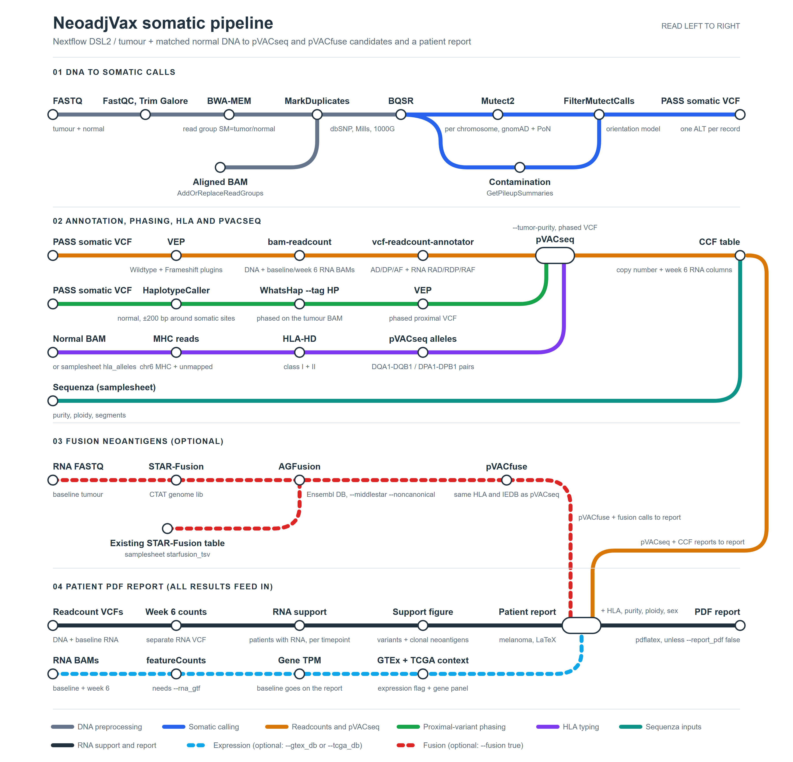

# NeoadjVax

Somatic neoantigen prediction for neoadjuvant melanoma vaccine work:
tumour and matched-normal DNA in, ranked pVACseq candidates out.
Nextflow DSL2, built to run on NCI Gadi (PBS Pro + Singularity).

<a href="assets/neoadjvax-somatic-metromap.svg">
  <picture>
    <source media="(prefers-color-scheme: dark)" srcset="assets/neoadjvax-somatic-metromap-dark.png">
    
  </picture>
</a>

```
tumour + normal DNA (FASTQ, or aligned BAM)
  │
  ├─ PREPROCESS_DNA     FastQC → Trim Galore → BWA-MEM → MarkDuplicates → BQSR
  ├─ SOMATIC_CALLING    Mutect2 (per chromosome, gnomAD + PoN) → read-orientation model
  │                     + contamination → FilterMutectCalls → PASS, normalised
  ├─ HLA_TYPING         HLA-HD on the normal (class I + II incl. DQA1/DPA1),
  │                     or the samplesheet's hla_alleles
  │                     + SpecHLA HLA-LOH read in from the samplesheet
  ├─ PROXIMAL_VARIANTS  HaplotypeCaller on the normal around somatic sites
  │                     → WhatsHap phasing on the tumour BAM → VEP
  ├─ NEOANTIGENS        VEP → bam-readcount (tumour + normal DNA, optional baseline
  │                     and week 6 RNA BAMs) → vcf-readcount-annotator
  │                     → pVACseq (--tumor-purity from Sequenza, baseline RNA counts,
  │                       --phased-proximal-variants-vcf) → week 6 RNA columns
  │                     → CCF from ploidy/segments
  ├─ EXPRESSION         optional GTEx/TCGA context, gene panel, shared tumour antigens
  ├─ FUSION             optional STAR-Fusion → AGFusion → pVACfuse, --fusion true
  ├─ PRIORITIZE         one ranked list per MHC class: HLA-LOH, clonality, expression
  │                     and agretopicity as flags, with a reason per rejection
  ├─ LONG_PEPTIDES      mutant protein context → 25mers to order (+ optional pVACvector)
  ├─ CLONAL_STRUCTURE   CCF clusters and which are still transcribed at week 6
  └─ REPORT             RNA support per timepoint (figure) → melanoma report (LaTeX → PDF)
                        + one .xlsx per patient for the wet lab
```

Sequenza and SpecHLA are not run here: purity, ploidy, the segments file
and the HLA-LOH result come in through the samplesheet from your existing
runs.

`--run` picks which analyses happen — `all` (the default), `somatic`,
`fusion`, `markers`, or a comma-separated combination. Alignment, HLA
typing, HLA-LOH and the Sequenza values always run whatever you choose.
See [`docs/RUNNING.md`](docs/RUNNING.md).

## Quick start

```bash
# once, from a Gadi login node (compute nodes have no network)
bash bin/prefetch_containers.sh

# copy and fill in the params file, check it, then launch
cp assets/params_somatic_gadi.example.yaml /scratch/jo11/$USER/somatic.yaml
bash bin/run_somatic_gadi.sh --check /scratch/jo11/$USER/somatic.yaml
bash bin/run_somatic_gadi.sh /scratch/jo11/$USER/somatic.yaml
```

Or directly:

```bash
nextflow run main.nf -profile gadi \
    --samplesheet samples.csv \
    --germline_resource af-only-gnomad.hg38.vcf.gz \
    --panel_of_normals 1000g_pon.hg38.vcf.gz \
    --contamination_sites small_exac_common_3.hg38.vcf.gz \
    --vep_cache /path/to/vep_cache --vep_plugins /path/to/vep_plugins \
    --hlahd_container /path/to/hlahd.sif \
    --outdir results/
```

## Documentation

- [`docs/RUNNING.md`](docs/RUNNING.md): `--run` — choosing which analyses a run does, and the peptide lengths.
- [`assets/samplesheet_schema.md`](assets/samplesheet_schema.md): the samplesheet, including purity, ploidy and segments.
- [`docs/ARCHITECTURE.md`](docs/ARCHITECTURE.md): each step, why it is there, and the outputs.
- [`docs/EXPRESSION.md`](docs/EXPRESSION.md): the optional GTEx/TCGA expression step and the presentation-machinery/driver panel, and building the reference tables.
- [`docs/HLA_LOH.md`](docs/HLA_LOH.md): reading a SpecHLA result in, and what counts as a lost allele.
- [`docs/PRIORITISATION.md`](docs/PRIORITISATION.md): the flags, the ranking, clonal structure and the per-patient workbook.
- [`docs/LONG_PEPTIDES.md`](docs/LONG_PEPTIDES.md): designing the peptides to order, and the optional pVACvector construct.
- [`docs/TAA.md`](docs/TAA.md): shared tumour antigens as a second channel.
- [`docs/FUSION.md`](docs/FUSION.md): the optional STAR-Fusion/AGFusion/pVACfuse branch.
- [`docs/REPORT.md`](docs/REPORT.md): the per-patient RNA-support figure and melanoma report.
- [`docs/DEPENDENCIES.md`](docs/DEPENDENCIES.md): every reference file and container, and where to get it.
- [`docs/RUNNING_ON_GADI.md`](docs/RUNNING_ON_GADI.md): launching and monitoring on Gadi.
- [`containers/hlahd/README.md`](containers/hlahd/README.md): building the HLA-HD image from your licensed download.

## Tests

Wiring only, never biological accuracy:

```bash
python -m unittest discover -s tests -p 'test_*.py'
python bin/check_nf_structure.py .
python tests/dna_somatic/make_fixture.py --outdir tests/dna_somatic/generated
NXF_SYNTAX_PARSER=v1 nextflow -c tests/dna_somatic/smoke.config run main.nf -stub-run
python tests/dna_somatic/check_results.py --manifest tests/dna_somatic/generated/manifest.json \
    --trace test-results/dna_somatic/trace.tsv --outdir test-results/dna_somatic
```

See [`tests/dna_somatic/README.md`](tests/dna_somatic/README.md).

## History

Up to v0.1.0-dev this repository also carried RNA variant calling,
splicing, gene fusion, ERV/TE, in-pipeline Sequenza and HLA-LOH branches.
They were removed in v0.2.0-dev to focus on the somatic path; they remain
in the git history on `main` before the somatic rebuild.
