# NeoadjVax architecture

Neoadjuvant melanoma vaccine neoantigen pipeline: DNA + RNA variant calling
feeding pVACseq (the part with an existing design — see
`[[neoantigen-score]]`), plus three new discovery branches — splicing,
gene fusion, and ERV neoantigens — scaffolded at roughly equal depth.

Orchestration: Nextflow DSL2. Execution: PBS Pro + Singularity on NCI Gadi
(`-profile gadi`), reusing Jayden's existing `.sif` images and PBS project
settings where they already exist, matching how `spliceai-variant-pipeline`
and the original RNA script already run. **See `docs/RUNNING_ON_GADI.md`
for how to actually launch this** — `qsub` mostly disappears from view
(Nextflow submits every step as its own PBS job automatically), but Gadi's
compute nodes having no external network means containers need a one-time
pre-caching step from the login node first.

**Containers: Singularity, not Docker**, under `-profile gadi` or
`-profile singularity` — Gadi's compute nodes have no Docker (no root on
HPC). Every image in `nextflow.config`'s `containers` block, including the
`docker://griffithlab/pvactools` reference, is pulled and converted to a
`.sif` by Singularity itself; Docker is never invoked. `-profile docker`
exists only as an optional local-dev convenience (mirrors the original DNA
script's Docker calls) for iterating off Gadi — not how this runs in
production. See the block's own comment in `nextflow.config` for detail.

**Already-aligned / already-called input**: three tiers per patient (DNA)
or patient-timepoint (RNA) — FASTQ (full pipeline), an already-aligned BAM
(skips QC/trim/align), or an already-called VCF (skips alignment AND
variant calling entirely). DNA: `tumor_bam`/`normal_bam` or a
patient-level `dna_vcf` column, per row. RNA: `rna_bam` (realigned via
STAR by default, or fed straight through with `--rna_skip_realignment
true` — a pipeline-wide flag, not per-row, since the original script
always realigned intentionally) or a per-timepoint `rna_vcf` column. A
`dna_vcf`-only patient with no normal sample must supply `hla_alleles`
directly — there's no normal BAM left to type HLA from, and
`main.nf`'s `validateDnaSamplesheet()`/`validateRnaSamplesheet()` catch
this and every other missing-input combination at launch, before any
compute starts. See `assets/samplesheet_schema.md` for the full column
reference and examples.

## Pipeline graph

```mermaid
flowchart TB
    subgraph DNA["DNA branch — dna_variant_calling.nf"]
        d1["Trim Galore + FastQC"] --> d2["BWA-MEM align"]
        d2 --> d3["AddReadGroups → MarkDuplicates"]
        d3 --> d4["Mutect2 (tumor vs normal)"]
        d4 --> d5["FilterMutectCalls"]
        d5 --> d6["Filter to standard chroms"]
    end

    subgraph RNA["RNA branch — rna_variant_calling.nf (per timepoint)"]
        r1["BAM → FASTQ (or FASTQ direct)"] --> r2["STAR two-pass align"]
        r2 --> r3["AddReadGroups → MarkDuplicates"]
        r3 --> r4["SplitNCigarReads"]
        r4 --> r5["BQSR"]
        r5 --> r6["HaplotypeCaller"]
        r6 --> r7["VariantFiltration"]
    end

    d6 --> match["RNA_SUPPORT_FILTER<br/>(DNA loci ∩ RNA support, per timepoint)"]
    r7 --> match
    match --> vep["VEP annotate<br/>(Wildtype + Frameshift plugins)"]
    normalbam["Normal DNA reads"] --> hla["xHLA typing<br/>(class I + DRB1; DQB1/DPB1 excluded)"]
    hla --> pvacseq["pVACseq"]
    vep --> pvacseq
    pvacseq --> core["Core neoantigen calls<br/>(per patient × timepoint)"]

    subgraph SPLICE["splicing_neoantigens.nf — stub past ingestion"]
        s1["Existing SpliceAI pipeline output<br/>(reused, not re-run)"] --> s2["Filter by delta score"]
        s2 --> s3["Splice→peptide — TODO"]
    end

    subgraph FUSION["fusion_neoantigens.nf"]
        f1["STAR-Fusion"] --> f2["AGFusion annotate — TODO"]
        f2 --> f3["pVACfuse"]
    end

    subgraph ERV["erv_neoantigens.nf"]
        e1["Telescope quantification"] --> e2["ERV→peptide — TODO,<br/>design decision open"]
    end

    style s3 fill:#4a2a2a,stroke:#c66
    style e2 fill:#4a2a2a,stroke:#c66
    style f2 fill:#4a2a2a,stroke:#c66
```

Red boxes = explicit TODO stubs (process exits 1 with a comment explaining
the open decision) — everything else is ported from your working scripts
or is new code built to the same standard.

## Where your original scripts went

| Original | Where it landed |
|---|---|
| `RNA_variant_pipeline.sh` (PBS) — STAR index, per-sample BAM→FASTQ→STAR→GATK RNA variant calling | `modules/local/rna/*.nf` + `workflows/rna_variant_calling.nf`. Same steps, same tool flags (e.g. `--dont-use-soft-clipped-bases`, `FS > 30.0 \|\| QD < 2.0`, `sjdbOverhang 149`) — checkpoint-by-file-existence replaced by Nextflow's own `-resume` cache, which does the same job without the manual `checkpoint_run` wrapper. |
| DNA pVACseq script (Python/Docker) — trim/align/Mutect2/VEP/pVACseq | Split across `modules/local/dna/*.nf` (through `FILTER_STANDARD_CHROMS`) and `workflows/pvacseq_core.nf` (VEP + pVACseq) — see below for why it's split. Docker calls became Singularity containers per `nextflow.config`'s `containers` block; swap back to `-profile docker` for local iteration if that's still useful. |

**One structural change from the original DNA script**: VEP annotation and
`pvacseq run` no longer happen immediately after Mutect2. They now happen
*after* `RNA_SUPPORT_FILTER`, on the smaller RNA-supported subset —
because `[[neoantigen-score]]`'s design is "RNA-supported VCF subset then
run through pVACseq," not "every raw DNA call through pVACseq." The
original script (DNA-only) had no RNA step to wait for, so this wasn't a
choice it needed to make.

## New code that didn't exist in either script

- **`bin/match_rna_support.py`** + `modules/local/matching/rna_support_filter.nf`
  — the RNA-support check itself. Matches DNA/RNA calls by exact
  `(CHROM, POS, REF, ALT)`, optionally thresholding on RNA ALT-allele read
  depth (`--min_rna_alt_reads`, default 1). This is the one part of the
  core backbone that's genuinely new rather than ported — worth a close
  look before trusting it on real data.
- **HLA typing** (`modules/local/hla_typing/xhla.nf`) — the DNA script
  took `--hla` as a hand-supplied list; nothing typed it. xHLA now runs on
  the **normal/germline** DNA BAM specifically, not tumor, to avoid bias
  from tumor HLA-LOH — which `[[loh-analysis]]` is already tracking
  separately, so typing off tumor reads here would fold that effect into
  the neoantigen calls unintentionally. xHLA types both classes
  (`[[neoantigen-score]]` calls for both, and neither original script did
  class II at all) from a single indexed BAM in one pass — but it only
  types the beta chain for DQB1/DPB1, and pVACtools needs those paired
  with an alpha chain (DQA1/DPA1) xHLA doesn't provide, so those two loci
  are typed but excluded from what reaches pVACseq (see
  `bin/parse_xhla_result.py`). Only class I (A/B/C) + DRB1 are usable
  today. Also: `pvacseq_algorithms` still defaults to `MHCflurry` (class I
  only) — DRB1 alleles won't actually get predicted against until a class
  II algorithm is added to that param too.
- **Two-samplesheet input design** (`--dna_samplesheet` / `--rna_samplesheet`,
  joined on `patient_id`) — because DNA is one baseline draw per patient and
  RNA is longitudinal (PRE/ED1/ED2/CLND). See `assets/samplesheet_schema.md`.

## Open decisions — need your input, not guessed at

1. **Splicing → peptide.** No standard tool converts a novel splice
   junction into a candidate peptide. Options: NeoSplice (purpose-built,
   narrower toolchain) vs. custom ORF translation built on the
   IsoformSwitchAnalyzeR output `[[neoadjuvant-splicing]]` already
   produces. See `modules/local/splicing/splice_to_peptide.nf`.
2. **ERV → peptide.** Same shape of problem, less prior art. Options:
   treat expressed loci as novel ORFs (reuses pVACtools infrastructure,
   hand-rolled and unvalidated scoring) vs. a dedicated published
   TE-neoantigen scorer (more defensible, more work). See
   `modules/local/erv/erv_to_peptide.nf`.
3. **Fusion branch's FASTQ source.** `fusion_neoantigens.nf` currently only
   reads `rna_fastq_r1/r2` from the samplesheet; most rows will only have
   `rna_bam` per the schema. Needs either its own BAM→FASTQ step or to
   share `RNA_VARIANT_CALLING`'s output — not decided yet.
4. **ERV branch's alignment.** Telescope wants multi-mapping reads that
   `RNA_VARIANT_CALLING`'s `--outFilterMultimapNmax 2` (carried over from
   your original script) discards — so it can't just reuse that BAM as-is.
   Needs its own STAR pass with relaxed multimapping, not yet built.
5. **RNA_variant_pipeline.sh tail was truncated** in what got pasted in —
   it references `${bn}.braf_allelic_counts.tsv` in its cleanup step and a
   trailing "PIPELINE SUMMARY" / `COLLECTOREOF` heredoc that never actually
   runs anything. The BRAF V600 allelic-count extraction itself isn't
   reflected anywhere in this scaffold — flagged rather than guessed at;
   send the missing piece if you still want it in the pipeline.
6. **DNA-RNA matching depth threshold.** `--min_rna_alt_reads` defaults to
   1 (any RNA support counts). Whether that's the right bar — vs. a higher
   depth threshold, or a VAF-based check instead of a raw read count — is
   worth deciding once there's real data to look at.

## What's real vs. stubbed, at a glance

**Fully ported / working shape**, ready to run once reference paths, VEP
cache/plugins, and containers are confirmed on Gadi:
DNA variant calling, RNA variant calling, RNA-support matching, VEP
annotation, pVACseq core.

**New but complete modules**, not yet run against real data:
xHLA typing (class I + DRB1), SpliceAI-output filtering, STAR-Fusion +
pVACfuse, Telescope ERV quantification.

**Explicit TODO stubs** (exit 1, comment explains the decision needed):
splice→peptide, ERV→peptide, AGFusion annotation.

**Unverified detail worth a one-off sanity check**: xHLA's in-container
entrypoint (`python /opt/bin/run.py`) and image tag (`0.0.0`) are both
sourced from a third-party Nextflow wrapper for xHLA, not xHLA's own docs
— see `modules/local/hla_typing/xhla.nf`'s comments.

## Next steps

1. Confirm reference/container paths in `nextflow.config` actually resolve
   on Gadi (`params.genome_fasta`, VEP cache/plugin dirs, CTAT resource lib,
   ERV annotation GTF — none of these have real paths filled in yet).
2. Fill in `--dna_samplesheet` / `--rna_samplesheet` for one real patient
   and do a dry run of just the core backbone
   (`--run_splicing_neoantigens false --run_fusion_neoantigens false
   --run_erv_neoantigens false`) before touching the new branches.
3. Pick a direction on the three open peptide-generation decisions above —
   those block real progress on splicing/fusion/ERV more than any missing
   code does.
