# NeoadjVax architecture

Neoadjuvant melanoma vaccine neoantigen pipeline: DNA + RNA variant calling
feeding pVACseq (the part with an existing design — see
`[[neoantigen-score]]`), three new discovery branches — splicing,
gene fusion, and ERV neoantigens — scaffolded at roughly equal depth, and
two further optional, independently-runnable branches: tumor
purity/ploidy (Sequenza, `--run_purity_ploidy`, fully ported from
`Sequenza_tools`, WGS/200bp bins only) and HLA loss-of-heterozygosity
(SpecHLA, `--run_hla_loh`, ported from your `NeoadjLOH` repo).
"Independently runnable" means what it says — neither needs the DNA/RNA
branches above turned on; see `assets/samplesheet_schema.md`.

Orchestration: Nextflow DSL2. Execution: PBS Pro + Singularity on NCI Gadi
(`-profile gadi`), reusing Jayden's existing `.sif` images and PBS project
settings where they already exist, matching how `spliceai-variant-pipeline`
and the original RNA script already run. **See `docs/RUNNING_ON_GADI.md`
for how to actually launch this** — `qsub` mostly disappears from view
(Nextflow submits every step as its own PBS job automatically), but Gadi's
compute nodes having no external network means containers need a one-time
pre-caching step from the login node first.

**Containers: Singularity, not Docker**, under `-profile gadi` or
`-profile singularity` — Gadi's compute nodes have no Docker (no root on
HPC). Every image in `nextflow.config`'s `containers` block, including the
`docker://griffithlab/pvactools` reference, is pulled and converted to a
`.sif` by Singularity itself; Docker is never invoked. `-profile docker`
exists only as an optional local-dev convenience (mirrors the original DNA
script's Docker calls) for iterating off Gadi — not how this runs in
production. See the block's own comment in `nextflow.config` for detail.

**Already-aligned / already-called input**: three tiers per patient (DNA)
or patient-timepoint (RNA) — FASTQ (full pipeline), an already-aligned BAM
(skips QC/trim/align), or an already-called VCF (skips alignment AND
variant calling entirely). DNA: `tumor_bam`/`normal_bam` or a
patient-level `dna_vcf` column, per row. RNA: `rna_bam` (realigned via
STAR by default, or fed straight through with `--rna_skip_realignment
true` — a pipeline-wide flag, not per-row, since the original script
always realigned intentionally) or a per-timepoint `rna_vcf` column. A
`dna_vcf`-only patient with no normal sample must supply `hla_alleles`
directly — there's no normal BAM left to type HLA from, and
`main.nf`'s `validateDnaSamplesheet()`/`validateRnaSamplesheet()` catch
this and every other missing-input combination at launch, before any
compute starts. See `assets/samplesheet_schema.md` for the full column
reference and examples.

## Pipeline graph

```mermaid
flowchart TB
    subgraph DNA["DNA branch — dna_variant_calling.nf"]
        d1["Trim Galore + FastQC"] --> d2["BWA-MEM align"]
        d2 --> d3["AddReadGroups → MarkDuplicates"]
        d3 --> d4["Mutect2 (tumor vs normal)"]
        d4 --> d5["FilterMutectCalls"]
        d5 --> d6["Filter to standard chroms"]
    end

    subgraph RNA["RNA branch — rna_variant_calling.nf (per timepoint)"]
        r1["BAM → FASTQ (or FASTQ direct)"] --> r2["STAR two-pass align"]
        r2 --> r3["AddReadGroups → MarkDuplicates"]
        r3 --> r4["SplitNCigarReads"]
        r4 --> r5["BQSR"]
        r5 --> r6["HaplotypeCaller"]
        r6 --> r7["VariantFiltration"]
    end

    d6 --> match["RNA_SUPPORT_FILTER<br/>(DNA loci ∩ RNA support, per timepoint)"]
    r7 --> match
    match --> vep["VEP annotate<br/>(Wildtype + Frameshift plugins)"]
    normalbam["Normal DNA reads"] --> hla["xHLA typing<br/>(class I + DRB1; DQB1/DPB1 excluded)"]
    hla --> pvacseq["pVACseq"]
    vep --> pvacseq
    pvacseq --> core["Core neoantigen calls<br/>(per patient × timepoint)"]

    subgraph SPLICE["splicing_neoantigens.nf — stub past ingestion"]
        s1["Existing SpliceAI pipeline output<br/>(reused, not re-run)"] --> s2["Filter by delta score"]
        s2 --> s3["Splice→peptide — TODO"]
    end

    subgraph FUSION["fusion_neoantigens.nf — --fusion_callers"]
        f0["RNA FASTQ (direct or BAM→FASTQ)"] --> f1a["STAR-Fusion<br/>(own STAR pass, CTAT lib)"]
        f0 --> f1b["Arriba<br/>(own STAR pass, relaxed multimap)"]
        f1a --> f2["AGFusion annotate — TODO,<br/>per caller"]
        f1b --> f2
        f2 --> f3["pVACfuse, per caller"]
    end

    subgraph ERV["erv_neoantigens.nf"]
        e0["RNA FASTQ (direct or BAM→FASTQ)"] --> e1a["ERV_STAR_ALIGN<br/>(own STAR pass, relaxed multimap)"]
        e1a --> e1b["samtools collate"]
        e1b --> e1c["Telescope quantification"]
        e1c --> e2["ERV→peptide — TODO,<br/>design decision open"]
    end

    subgraph PURITY["purity_ploidy.nf — --run_purity_ploidy (from Sequenza_tools)"]
        pp0["Tumor+normal BAM pair"] --> pp1["bam2seqz + seqz_binning<br/>(per chromosome, 200bp bins)"]
        pp1 --> pp1b["merge-bin200-files.pl +<br/>merge-header-bin200.pl"]
        pp1b --> pp1c["run-sequenza.R<br/>(sequenza.extract/fit/results)"]
        pp1c --> pp2["Extract top solution<br/>(new code — targets standard<br/>sequenza output, unverified)"]
    end

    subgraph LOH["hla_loh.nf — --run_hla_loh (SpecHLA, from NeoadjLOH)"]
        l1["Tumor DNA BAM"] --> l2["Extract HLA reads"]
        l2 --> l3["SpecHLA typing"]
        pp2 -.purity/ploidy.-> l4
        l3 --> l4["cal.hla.copy.pl<br/>(HLA LOH calls)"]
    end

    style s3 fill:#4a2a2a,stroke:#c66
    style e2 fill:#4a2a2a,stroke:#c66
    style f2 fill:#4a2a2a,stroke:#c66
    style pp2 fill:#4a3a1a,stroke:#c96
```

Red boxes = explicit TODO stubs (process exits 1 with a comment explaining
the open decision). Amber (`pp2`) = real and runs, but is new code (none
of your scripts pick a top solution) built on a targeted-not-confirmed
assumption about `run-sequenza.R`'s output shape — worth a spot-check
before trusting, not a stub. Everything else is ported from your working
scripts or is new code built to the same standard.

## Where your original scripts went

| Original | Where it landed |
|---|---|
| `RNA_variant_pipeline.sh` (PBS) — STAR index, per-sample BAM→FASTQ→STAR→GATK RNA variant calling | `modules/local/rna/*.nf` + `workflows/rna_variant_calling.nf`. Same steps, same tool flags (e.g. `--dont-use-soft-clipped-bases`, `FS > 30.0 \|\| QD < 2.0`, `sjdbOverhang 149`) — checkpoint-by-file-existence replaced by Nextflow's own `-resume` cache, which does the same job without the manual `checkpoint_run` wrapper. |
| DNA pVACseq script (Python/Docker) — trim/align/Mutect2/VEP/pVACseq | Split across `modules/local/dna/*.nf` (through `FILTER_STANDARD_CHROMS`) and `workflows/pvacseq_core.nf` (VEP + pVACseq) — see below for why it's split. Docker calls became Singularity containers per `nextflow.config`'s `containers` block; swap back to `-profile docker` for local iteration if that's still useful. |

**One structural change from the original DNA script**: VEP annotation and
`pvacseq run` no longer happen immediately after Mutect2. They now happen
*after* `RNA_SUPPORT_FILTER`, on the smaller RNA-supported subset —
because `[[neoantigen-score]]`'s design is "RNA-supported VCF subset then
run through pVACseq," not "every raw DNA call through pVACseq." The
original script (DNA-only) had no RNA step to wait for, so this wasn't a
choice it needed to make.

## New code that didn't exist in either script

- **Pipeline selection (`--pipelines`)** (`main.nf`'s `applyPipelineSelection()`)
  — a friendlier alternative to setting each `--run_*` flag individually.
  `--pipelines "somatic_neoantigen,gene_fusion"` (comma-separated,
  case/spacing/punctuation-insensitive — "geneFusion", "gene-fusion",
  "Gene Fusion" all match) resolves to the underlying flags via a small
  registry and is **authoritative** when set: every branch not named gets
  turned off, even ones whose individual `--run_*` default is `true`. Some
  names turn on more than one flag together — `somatic_neoantigen` needs
  `run_dna_variant_calling` + `run_rna_variant_calling` +
  `run_pvacseq_core` all three, matching the existing constraint that
  `PVACSEQ_CORE` can't run alone (see `main.nf`'s existing error for that).
  Leave `--pipelines` unset to keep controlling each branch with its own
  flag, exactly as before — nothing changes for existing invocations. See
  `README.md` for the full name table.
- **Gene fusion calling, for real** (`modules/local/fusion/star_fusion.nf`,
  `arriba_align.nf`, `arriba.nf`) — `--fusion_callers` (default
  `starfusion,arriba`, comma-separated) runs either or both in parallel per
  patient-timepoint, each tagged through the rest of the branch so results
  don't collide. STAR-Fusion and Arriba each run their **own** STAR pass —
  they're not sharing one alignment, and neither reuses
  `RNA_VARIANT_CALLING`'s BAM: STAR-Fusion's wrapper needs the CTAT genome
  lib's own bundled index, and Arriba needs relaxed multimapping
  (`--outFilterMultimapNmax 50`) plus a specific set of chimeric-alignment
  flags copied verbatim from Arriba's own documented quickstart — both
  incompatible with the RNA branch's `--outFilterMultimapNmax 2` two-pass
  settings. This also resolves the old "fusion branch's FASTQ source" open
  decision: the branch now consumes `rna_bam` samplesheet rows too (via
  `RNA_VARIANT_CALLING`'s own `BAM_TO_FASTQ` module, reused rather than
  duplicated), not just `rna_fastq_r1/r2`. What's still a stub: AGFusion
  annotation downstream of either caller (needs `agfusion-build` run
  against our GENCODE v46 GTF first — a real prerequisite, not done yet),
  so `pvacfuse` can't actually run on fusion calls end-to-end today even
  though the calling step itself is real. Also worth a look: the Arriba
  container tag (`2.5.1--h87b9561_0`) was confirmed via bioconda's build
  string and a partial-fetch check against the depot mirror rather than a
  full browser-verified pull — high confidence, worth a one-off
  `singularity pull` sanity check before relying on it in production. And
  Arriba's blacklist/known-fusions/protein-domains reference files
  (`--arriba_blacklist`/`--arriba_known_fusions`/`--arriba_protein_domains`)
  are unset by default — Arriba runs without them (its own docs say so),
  just with more false-positive calls; fetch them via Arriba's own bundled
  `download_references.sh hg38+GENCODE46` before trusting real output.
- **ERV calling, for real** (`modules/local/erv/erv_star_align.nf`,
  `collate_bam.nf`, `telescope_quant.nf`) — researched tool choice rather
  than just carrying forward the original stub's assumption: Telescope
  confirmed as the right call over TEtranscripts/TElocal (family/locus-level
  counts built for differential expression, not per-locus reassignment
  confidence) and ERVmap (needs its own dedicated ERV-only reference/
  alignment) by two independently published 2025/2026 HERV-in-cancer
  studies both using Telescope on a standard STAR BAM. The branch now runs
  its own dedicated `ERV_STAR_ALIGN` pass (`--outFilterMultimapNmax 100
  --winAnchorMultimapNmax 100`, sourced from TEtranscripts' README and
  STAR's own maintainer — resolves the old "ERV branch's alignment" open
  decision) followed by an explicit `samtools collate` (Telescope rejects
  coordinate-sorted input — its own docs say so directly) before
  `telescope assign`. `--telescope_max_iter` defaults to 1000 (vs.
  Telescope's own default of 100), matching a recently published
  cutaneous-melanoma HERV profiling study doing the same STAR+Telescope
  combination. `--erv_annotation_gtf` should point at one of Telescope's
  own official builds (`mlbendall/telescope_annotation_db` —
  `retro.hg38.v1` recommended default, `HERV_rmsk.hg38.v2` for broader
  RepeatMasker-derived coverage) rather than an unspecified "RepeatMasker/
  hervd" GTF as the old comment vaguely put it. Also caught this pass: the
  Telescope container tag already in `nextflow.config`
  (`1.0.3--py38h24c8ff8_1`) was simply wrong — confirmed 404 on
  depot.galaxyproject.org — and has been fixed to `py38h8e05983_5`
  (confirmed against bioconda's published build list and a partial-fetch
  check, same methodology as Arriba's tag). What's still a stub, unchanged
  by this pass: `ERV_TO_PEPTIDE` — see the "ERV → peptide" open decision
  above, now with two cited published approaches to choose between instead
  of just a hypothetical shape.
- **`bin/match_rna_support.py`** + `modules/local/matching/rna_support_filter.nf`
  — the RNA-support check itself. Matches DNA/RNA calls by exact
  `(CHROM, POS, REF, ALT)`, optionally thresholding on RNA ALT-allele read
  depth (`--min_rna_alt_reads`, default 1). This is the one part of the
  core backbone that's genuinely new rather than ported — worth a close
  look before trusting it on real data.
- **HLA typing** (`modules/local/hla_typing/xhla.nf`) — the DNA script
  took `--hla` as a hand-supplied list; nothing typed it. xHLA now runs on
  the **normal/germline** DNA BAM specifically, not tumor, to avoid bias
  from tumor HLA-LOH — which `[[loh-analysis]]` is already tracking
  separately, so typing off tumor reads here would fold that effect into
  the neoantigen calls unintentionally. xHLA types both classes
  (`[[neoantigen-score]]` calls for both, and neither original script did
  class II at all) from a single indexed BAM in one pass — but it only
  types the beta chain for DQB1/DPB1, and pVACtools needs those paired
  with an alpha chain (DQA1/DPA1) xHLA doesn't provide, so those two loci
  are typed but excluded from what reaches pVACseq (see
  `bin/parse_xhla_result.py`). Only class I (A/B/C) + DRB1 are usable
  today. Also: `pvacseq_algorithms` still defaults to `MHCflurry` (class I
  only) — DRB1 alleles won't actually get predicted against until a class
  II algorithm is added to that param too.
- **Two-samplesheet input design** (`--dna_samplesheet` / `--rna_samplesheet`,
  joined on `patient_id`) — because DNA is one baseline draw per patient and
  RNA is longitudinal (PRE/ED1/ED2/CLND). See `assets/samplesheet_schema.md`.
- **HLA-LOH branch** (`workflows/hla_loh.nf`, `--run_hla_loh`) — ported
  faithfully from your
  [NeoadjLOH](https://github.com/JaydenBeckwith/NeoadjLOH) repo, not
  reinvented. Three SpecHLA stages on the **tumor** BAM (extract → type →
  LOH), same as `run_sample.pbs`, including its documented gotchas: the
  fastq-pairing fallback anchored on literal `_1.`/`_2.` suffixes (this
  cohort's digit-heavy sample IDs break a loose glob), and the
  `hla.result.txt` vs `hla.result.details.txt` selection logic (the wrong
  glob previously left `KeptHLA`/`LossHLA` silently blank). One structural
  change from the original: the result-selection and freq-list-building
  steps moved from a shared-`$OUTROOT` shell script into the typing process
  itself, since each Nextflow process gets its own isolated work
  directory — the logic is unchanged, just relocated a step earlier; see
  `modules/local/hla_loh/spechla_typing.nf`'s header comment. This is a
  **separate** HLA typing call from xHLA above — SpecHLA types the tumor
  BAM for its own internal LOH calculation and doesn't consume xHLA's
  output, so the two can't be merged or shared even though both produce
  "HLA alleles" for the same patient.
- **Purity/ploidy branch** (`workflows/purity_ploidy.nf`,
  `--run_purity_ploidy`) — **fully ported**. `git clone`ing
  [Sequenza_tools](https://github.com/JaydenBeckwith/Sequenza_tools)
  failed from this build environment (private repo, unlike the public
  `NeoadjLOH`), so you pasted the four PBS wrapper scripts
  (`sequenza_step1-4.sh`) plus, in a follow-up, the three scripts they
  call out to: `bin/merge-bin200-files.pl`, `bin/merge-header-bin200.pl`,
  `bin/run-sequenza.R` — all three are your actual scripts, unmodified,
  just relocated into this pipeline's `bin/` (which Nextflow auto-adds to
  every process's `PATH`, so they're invoked by bare name exactly as the
  PBS scripts did). Steps 1 (bam2seqz + seqz_binning, per chromosome), 2
  (merge, via your two perl scripts), and 4 (Sequenza R fit, via your
  `run-sequenza.R`) are all faithfully ported, including the exact
  gender/sex lookup logic (`--sequenza_gender_csv`, same
  melpin-column2/gender-column7 CSV format, same skip-with-warning-on-no-
  match behaviour) and the R-4.0 gzip-decompress workaround. Step 3
  ("collect merged files into one directory") is dropped entirely — it
  only existed to move files between two PBS jobs sharing a filesystem,
  and Nextflow's own channel staging already does that between
  `SEQUENZA_MERGE_BINS` and `SEQUENZA_FIT`.
  Two things surfaced from actually reading the real scripts, worth
  knowing about rather than discovering at runtime:
    1. **WES (50bp bins) doesn't work.** `merge-bin200-files.pl` hardcodes
       `_bin200` in every filename it looks for — it's not parametrized by
       bin size at all, confirmed by reading the script, not guessed.
       `--sequenza_seq_type wes` now errors at launch rather than failing
       confusingly mid-run; only WGS (200bp, the original's only tested
       path) works today.
    2. **`merge-bin200-files.pl` builds its own `seqz.header`** — it
       `zcat`s the header line straight off chr1's binned file every time
       it runs. An earlier draft of this branch pre-supplied a
       reconstructed "standard" `assets/seqz.header` for exactly this
       purpose; that file and the plumbing around it are gone now that the
       real script turned out not to need it (it would have just been
       overwritten anyway).
  The one piece that's genuinely **new code**, because none of your five
  scripts do it: turning `run-sequenza.R`'s output into a single
  `(purity, ploidy)` value per sample (`sequenza_extract_top_solution.nf`
  + `bin/extract_sequenza_top_solution.py`). It targets
  `sequenza.results()`'s standard `<sample>_alternative_solutions.txt`
  output (documented sequenza R package behaviour) and picks the
  best-scoring row by a tolerantly-matched SLPP/LPP/score column — a
  defensible mechanical choice, but not confirmed against NeoadjLOH's
  `sequenza_top_solutions_summary.csv` (whatever built *that* wasn't among
  what you sent) or against a real run of your `run-sequenza.R`. Spot-check
  one sample's output before trusting it. Also worth double-checking:
  `run-sequenza.R`'s branch on sex is a literal `== "male"` string
  comparison — a `--sequenza_gender_csv` using single-letter "M"/"F" codes
  instead of spelled-out "male"/"female" would silently misclassify every
  sample as female (wrong chromosome list, no Y).
- **Note on a stale comment in your own `NeoadjLOH` repo**: `config.sh`'s
  comment says `PURITY_CSV` is "assumed TAB-delimited" and that comma is
  the fallback case — but `submit_all.sh`'s actual code already parses it
  with `IFS=','`, and the README documents `sample,purity,ploidy` as
  comma-delimited too. So comma is what actually runs; the comment is just
  out of date. `--purity_ploidy_csv` here follows the real (comma)
  behaviour, matching the README and `submit_all.sh` rather than the
  `config.sh` comment.

## Open decisions — need your input, not guessed at

1. **Splicing → peptide.** No standard tool converts a novel splice
   junction into a candidate peptide. Options: NeoSplice (purpose-built,
   narrower toolchain) vs. custom ORF translation built on the
   IsoformSwitchAnalyzeR output `[[neoadjuvant-splicing]]` already
   produces. See `modules/local/splicing/splice_to_peptide.nf`.
2. **ERV → peptide.** Same shape of problem, less prior art — now backed by
   two actual published approaches to pick between rather than just a
   hypothetical shape (researched this pass): (a) six-frame ORF translation
   of expressed Telescope loci above an expression threshold, in the style
   of ObsERV's TPM>1 + MHC-I/II ligand scoring (Frontiers/npj Vaccines,
   2025) — reuses this pipeline's own pVACtools/NetMHCpan setup, hand-rolled
   and unvalidated scoring logic, less work; (b) a dedicated de novo
   transcript-assembly pipeline in the style of TEProF2/Attig et al. (Nature
   Genetics, 2023) — a real installable tool, more defensible, considerably
   more infrastructure (Cufflinks/TopHat + CPC2/Pfam + mass-spec validation
   in the original paper) and narrower in scope (TE-chimeric transcripts,
   not any expressed ERV locus). See `modules/local/erv/erv_to_peptide.nf`
   for the full writeup and citations.
3. ~~**Fusion branch's FASTQ source.**~~ Resolved — `fusion_neoantigens.nf`
   now reuses `RNA_VARIANT_CALLING`'s own `BAM_TO_FASTQ` module for
   `rna_bam` samplesheet rows (alongside `rna_fastq_r1/r2` rows, used as-is),
   so both samplesheet shapes work. What's still genuinely open in that
   branch: reconciling STAR-Fusion's and Arriba's fusion calls into one set
   isn't attempted — both callers' results are kept separate (tagged, in
   separate output subdirectories) rather than merged, since there's no
   settled logic for two callers disagreeing on the same event.
4. ~~**ERV branch's alignment.**~~ Resolved — `erv_neoantigens.nf` now runs
   its own dedicated `ERV_STAR_ALIGN` pass (`--outFilterMultimapNmax 100
   --winAnchorMultimapNmax 100`, sourced from TEtranscripts' own README and
   STAR's maintainer, not guessed) rather than reusing
   `RNA_VARIANT_CALLING`'s BAM, which discards exactly the multi-mapping
   reads ERV/TE loci need at its `--outFilterMultimapNmax 2`. A
   `samtools collate` step was also added ahead of Telescope, which
   specifically rejects coordinate-sorted input — see
   `modules/local/erv/erv_star_align.nf` / `collate_bam.nf`.
5. **RNA_variant_pipeline.sh tail was truncated** in what got pasted in —
   it references `${bn}.braf_allelic_counts.tsv` in its cleanup step and a
   trailing "PIPELINE SUMMARY" / `COLLECTOREOF` heredoc that never actually
   runs anything. The BRAF V600 allelic-count extraction itself isn't
   reflected anywhere in this scaffold — flagged rather than guessed at;
   send the missing piece if you still want it in the pipeline.
6. **DNA-RNA matching depth threshold.** `--min_rna_alt_reads` defaults to
   1 (any RNA support counts). Whether that's the right bar — vs. a higher
   depth threshold, or a VAF-based check instead of a raw read count — is
   worth deciding once there's real data to look at.
7. **Whether `sequenza_extract_top_solution.nf`'s "best-scoring row" pick
   is actually right.** See the note above — it's new code (none of your
   five Sequenza_tools scripts pick a single top solution), targeting the
   standard sequenza R package output convention, not confirmed against a
   real run or against NeoadjLOH's `sequenza_top_solutions_summary.csv`.
   Spot-check it once real data is available; if NeoadjLOH's summary CSV
   is itself built by a script you have, that should replace this one.
8. **`HLA_LOH`'s tumor/purity-ploidy join is a silent inner join.** A
   patient with a tumor BAM but no matching purity/ploidy row (wrong
   `sample`/`patient_id` spelling, a row missing from `--purity_ploidy_csv`,
   etc.) is currently just dropped from the LOH output rather than erroring
   — worth turning into a loud `error`/warning once there's a real cohort
   to run this against and mismatches would otherwise be easy to miss.

## What's real vs. stubbed, at a glance

**Fully ported / working shape**, ready to run once reference paths, VEP
cache/plugins, and containers are confirmed on Gadi:
DNA variant calling, RNA variant calling, RNA-support matching, VEP
annotation, pVACseq core, and now the purity/ploidy branch
(`sequenza_bam2seqz_binned.nf` / `sequenza_merge_bins.nf` / `sequenza_fit.nf`,
wrapping your actual `bin/merge-bin200-files.pl` /
`bin/merge-header-bin200.pl` / `bin/run-sequenza.R`, WGS/200bp-bins only).

**New but complete modules**, not yet run against real data:
xHLA typing (class I + DRB1), SpliceAI-output filtering, gene fusion calling
via STAR-Fusion and/or Arriba (`--fusion_callers`, both run in parallel by
default, each with its own dedicated STAR pass — see `modules/local/fusion/`)
+ pVACfuse (caller-aware, downstream of AGFusion), ERV/TE quantification via
its own STAR pass + samtools collate + Telescope (`modules/local/erv/`),
the SpecHLA HLA-LOH branch (`modules/local/hla_loh/*.nf`,
ported from your `NeoadjLOH` repo), and the purity/ploidy branch's
top-solution extraction (`sequenza_extract_top_solution.nf` — new code, not
a port, see the caveat above).

**Explicit TODO stubs** (exit 1, comment explains the decision needed):
splice→peptide, ERV→peptide, AGFusion annotation.

**Unverified detail worth a one-off sanity check**: xHLA's in-container
entrypoint (`python /opt/bin/run.py`) and image tag (`0.0.0`) are both
sourced from a third-party Nextflow wrapper for xHLA, not xHLA's own docs
— see `modules/local/hla_typing/xhla.nf`'s comments. Similarly, SpecHLA's
three in-container command paths (`spechla_extract_cmd`/`spechla_typing_cmd`/
`spechla_loh_cmd` in `nextflow.config`) carry forward `config.sh`'s own
"neither of us has inspected this .sif yet" caveat — worth the recon
command in that param block's comment before a real run.

## Next steps

1. Confirm reference/container paths in `nextflow.config` actually resolve
   on Gadi (`params.genome_fasta`, VEP cache/plugin dirs, CTAT resource lib,
   ERV annotation GTF — none of these have real paths filled in yet).
2. Fill in `--dna_samplesheet` / `--rna_samplesheet` for one real patient
   and do a dry run of just the core backbone
   (`--run_splicing_neoantigens false --run_fusion_neoantigens false
   --run_erv_neoantigens false`) before touching the new branches.
3. Pick a direction on the two open peptide-generation decisions above
   (splicing→peptide, ERV→peptide) — those block real end-to-end progress on
   those two branches more than any missing code does. The fusion branch's
   remaining gap (AGFusion) isn't a design decision, just a prerequisite not
   yet done — see item 7 below.
4. Confirm `--sequenza_conda_sh` / `--sequenza_conda_bin_fallback` point at
   wherever the `r_sequenza` conda env actually lives — the defaults are
   copied from a personal Gadi home directory (`/home/562/jb1592/...`) in
   the original scripts. Also confirm `--sequenza_gender_csv`'s gender
   column spells out "male"/"female" rather than single-letter codes (see
   the purity/ploidy branch's note above) — `run-sequenza.R`'s sex branch
   would silently misfire otherwise.
5. Smoke-test both `--run_hla_loh` and `--run_purity_ploidy` on one sample
   each before a real cohort run — same as `NeoadjLOH`'s own README
   recommends for HLA-LOH (`bash submit_all.sh SAMPLE_ID`), and doubly
   worth it for purity/ploidy since `sequenza_extract_top_solution.nf`'s
   "top solution" pick hasn't been checked against a real
   `run-sequenza.R` run yet — compare its output to
   `<sample>_alternative_solutions.txt` by eye the first time.
6. Try out `--pipelines` on a real invocation (e.g.
   `--pipelines somatic_neoantigen,gene_fusion`) to confirm the friendly
   names resolve the way you expect before relying on it for a full run —
   see `README.md` for the full name table.
7. Before trusting real fusion-calling output: run Arriba's own
   `download_references.sh hg38+GENCODE46` and set
   `--arriba_blacklist`/`--arriba_known_fusions`/`--arriba_protein_domains`
   (Arriba runs without them, just with more false positives per its own
   docs); do a one-off `singularity pull` on the Arriba container tag to
   confirm it (see `nextflow.config`'s comment on it); and note the
   AGFusion step downstream of both callers is still a stub pending
   `agfusion-build` against the GENCODE v46 GTF, so `pvacfuse` on fusion
   calls doesn't run end-to-end yet even though calling itself is real.
8. Before trusting real ERV-calling output: download one of Telescope's
   official annotation builds (`mlbendall/telescope_annotation_db` —
   `retro.hg38.v1` recommended) and point `--erv_annotation_gtf` at it; do a
   one-off `singularity pull` on the (now-corrected) Telescope container tag
   to confirm it; and pick a direction on `ERV_TO_PEPTIDE` (item 2 above)
   before expecting any peptide output from this branch — quantification
   runs end-to-end, peptide generation still doesn't.
